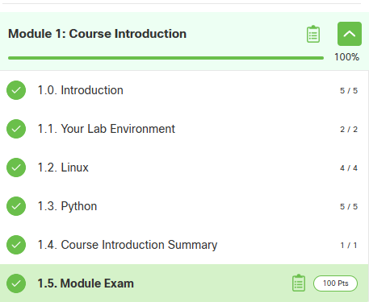

# Day 1 Report — DevNet Sprint

## 1. Student
- Name: Ostrovenko Pavel
- Group: IB-23-5B
- GitHub repo: https://github.com/PaT50-1/devnat-day1
- Day1 Token: D1-IB-23-5b-14-D3B8

## 2. NetAcad progress (Module 1)
- Completed items: first module (full)
- Screenshot:

## 3. VM evidence
- File: `artifacts/day1/env.txt` exists: No
- Screenshot:

## 4. Repo structure (must match assignment)
- `src/day1_api_hello.py` : Yes
- `tests/test_day1_api_hello.py` : Yes
- `schemas/day1_summary.schema.json` : Yes
- `artifacts/day1/summary.json` : Yes
- `artifacts/day1/response.json` : Yes

## 5. Commands run (paste EXACT output)
### 5.1 Script run
  "run": {
    "python": "3.8.2",
    "platform": "linux"
  }
}