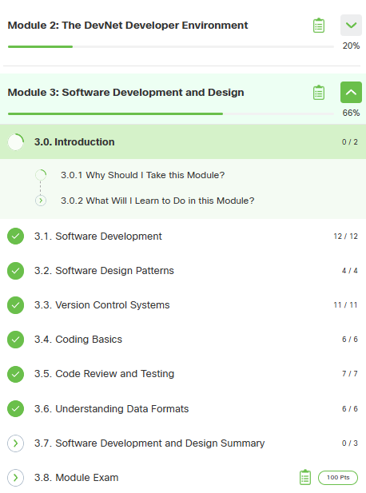
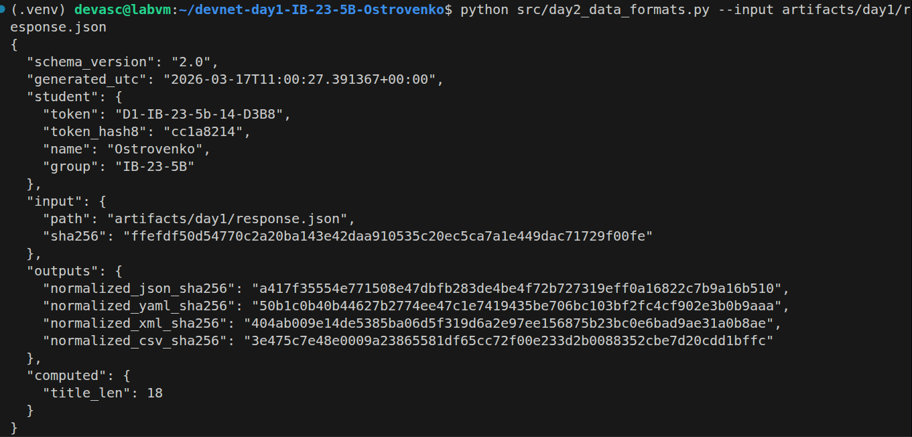
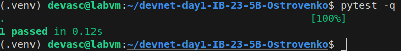

# Day 2 Report — Git + Data Formats + Tests

## 1) Student
- Name: Ostrovenko Pavel
- Group: IB-23-5B
- Token: D1-IB-23-5b-14-D3B8
- Repo: https://github.com/PaT50-1/devnat-day1/tree/main
- PR link (day2): https://github.com/PaT50-1/devnat-day1/pull/1#issue-4086311891

## 2) NetAcad progress

## 3) Git evidence
- File `artifacts/day2/git_log.txt` exists: Yes
- File `artifacts/day2/conflict_log.txt` exists: Yes
- Conflict note: Branches feature/day2-readme-A and feature/day2-readme-B both modified the same line in README.md. Resolved manually by keeping both entries and removing conflict markers (<<<<<<<, =======, >>>>>>>).

## 4) Generated artifacts (Day2)
- normalized.json: [Yes/No]
- normalized.yaml: [Yes/No]
- normalized.xml: [Yes/No]
- normalized.csv: [Yes/No]
- summary.json: [Yes/No]

## 5) Commands output (paste EXACT output)
### 5.1 Generator

### 5.2 Tests

## 6) What I learned (3–6 bullets)
- How to serialize the same data model into multiple formats: JSON, YAML, XML, CSV
- How to validate JSON output against a JSON Schema using jsonschema
- How to intentionally create and resolve a real merge conflict in Git
- How to properly structure a project into src/, tests/, schemas/ directories

## 7) Problems & fixes (at least 1)
- Problem: Both feature/day2-readme-A and feature/day2-readme-B modified the same line in README.md, causing a merge conflict when trying to merge branch B into main
- Fix: Opened README.md, manually removed conflict markers (<<<<<<<, =======, >>>>>>>), kept both lines, then ran git add README.md and git commit -m "Resolve README conflict (Day2)"`
- Proof: artifacts/day2/conflict_log.txt