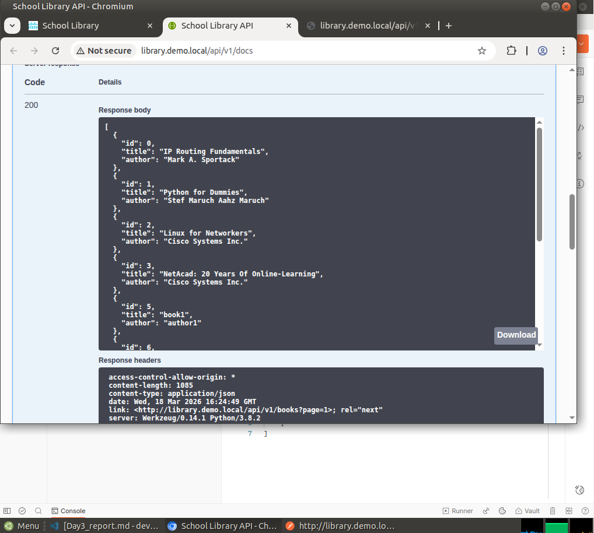
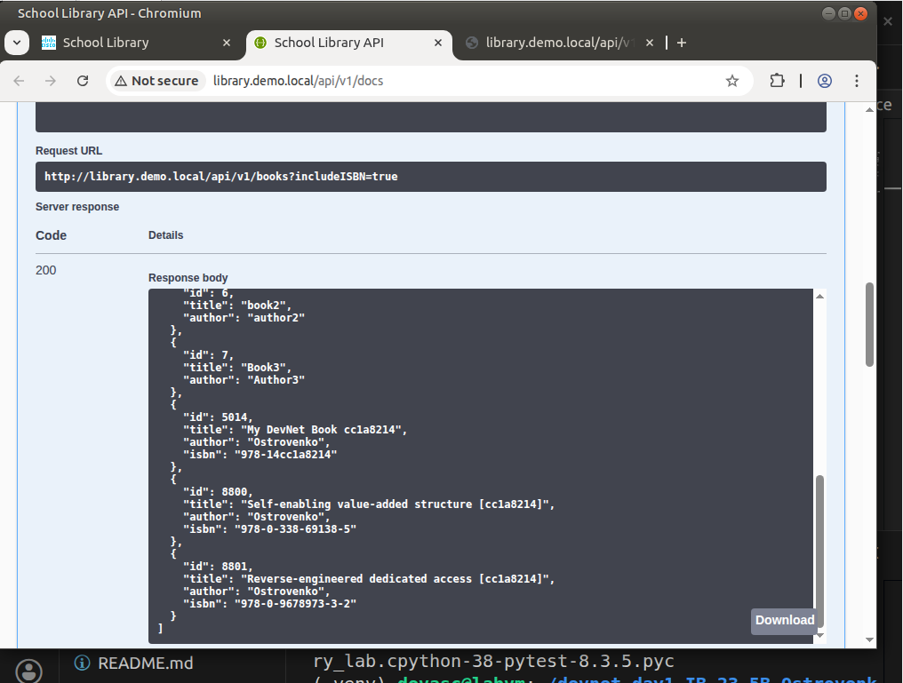
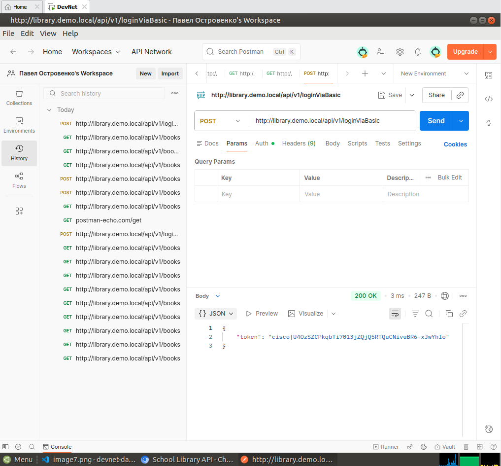
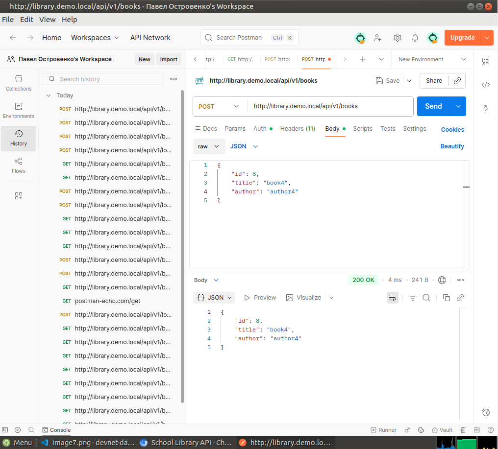
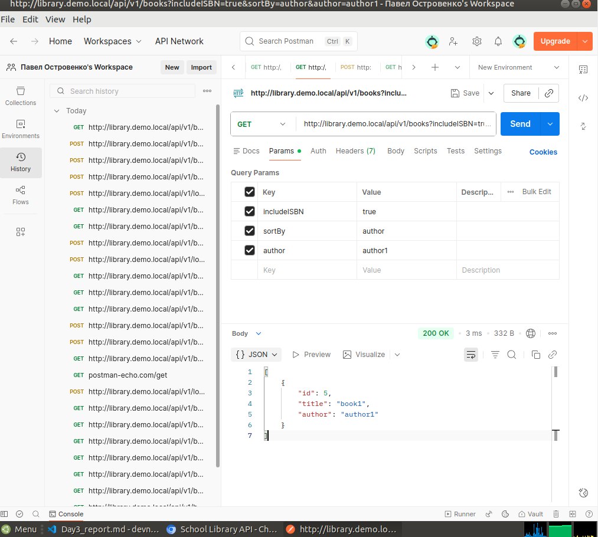
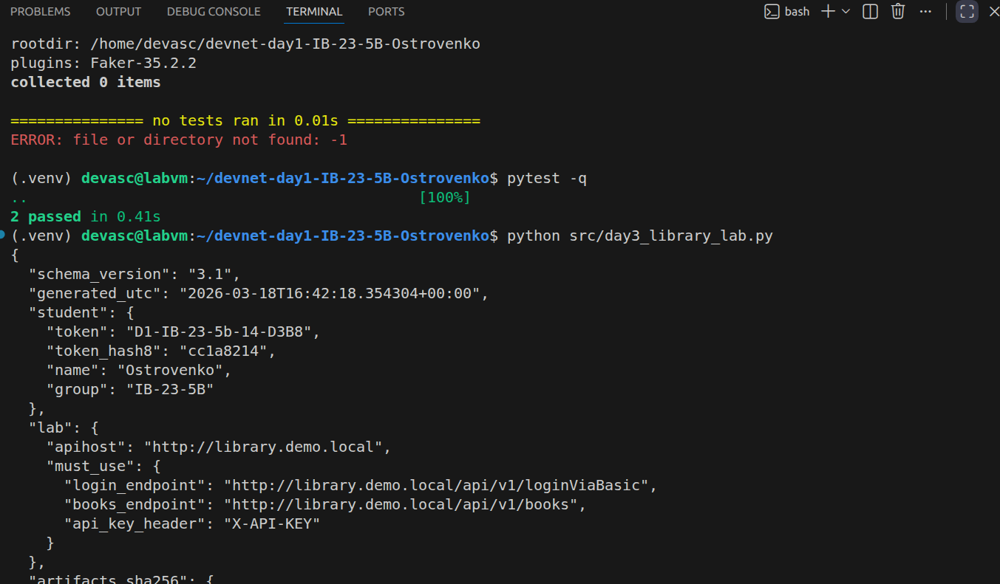

# Day 3 Report — Lab 4.5.5 + Auto-check artifacts

## 1) Student
- Name: Ostrovenko Pavel
- Group: IB-23-5B
- Token: D1-IB-23-5b-14-D3B8   
- Repo: https://github.com/PaT50-1/devnat-day1

## 2) Lab 4.5.5 completion evidence
- API docs (Try it out) screenshots:

- Postman screenshots: [list]

- Python run screenshot: [list]

## 3) Artifacts checklist
- artifacts/day3/books_before.json: Yes
- artifacts/day3/books_sorted_isbn.json: Yes
- artifacts/day3/mybook_post.json: Yes
- artifacts/day3/books_by_me.json: Yes
- artifacts/day3/add100_report.json: Yes
- artifacts/day3/postman_collection.json: Yes
- artifacts/day3/postman_environment.json: Yes
- artifacts/day3/curl_get_books.txt: Yes
- artifacts/day3/curl_get_books_isbn.txt: Yes
- artifacts/day3/curl_get_books_sorted.txt: Yes
- artifacts/day3/summary.json: Yes

## 4) Command outputs (paste exact)
### 4.1 Script run
{
  "schema_version": "3.1",
  "generated_utc": "2026-03-18T16:43:26.014307+00:00",
  "student": {
    "token": "D1-IB-23-5b-14-D3B8",
    "token_hash8": "cc1a8214",
    "name": "Ostrovenko",
    "group": "IB-23-5B"
  },
  "lab": {
    "apihost": "http://library.demo.local",
    "must_use": {
      "login_endpoint": "http://library.demo.local/api/v1/loginViaBasic",
      "books_endpoint": "http://library.demo.local/api/v1/books",
      "api_key_header": "X-API-KEY"
    }
  },
  "artifacts_sha256": {
    "books_before": "432c6bc4950a0832850952544e96a966af2c8fc121c06d7d721c338f127b042c",
    "books_sorted_isbn": "996cc60cc76291eac8cf88a426908fde0ad0def0eb9de5470dbcb765a0af2bb6",
    "mybook_post": "cee6408d5cadb0a3e3e8b55084b1f33c980eccaebf9e6e6fcd9c3b61e437bf82",
    "books_by_me": "f7d2b293adcbbd17429920b715ad377e9603f3ca997066e968d12fe6c79845c4",
    "add100_report": "e0ba6c8012a2dd46d13fce54ffdd843d1de13818985babc9844d6fc1e5d968e8",
    "postman_collection": "184a20c59ede7cff4e34ce42200fc3a5b98a6d3e9ee35ed7b8a1b376da22facf",
    "postman_environment": "d350aacb67e35301def2c497a6ea2f10442c4007dcea847dce40af9c55ee1e50",
    "curl_get_books": "de64bae22fde03848fbeb14e2a6c661cf7e9eed12f29b574d596224bf5bf6bf9",
    "curl_get_books_isbn": "ee1093008a5d89a75d9aaf8a2c8a7987c8841bce0c4028d02d32e78f083fb227",
    "curl_get_books_sorted": "e3b0c44298fc1c149afbf4c8996fb92427ae41e4649b934ca495991b7852b855"
  },
  "validation": {
    "must_have_mybook_title_contains_token_hash8": true,
    "must_have_added_100": true
  }
}

### 4.2 Tests
..                                                                                                       [100%]
2 passed in 0.31s

## 5) Problems & fixes (at least 1)
- Problem: Postman stuck on "Sending request..." infinitely for GET /api/v1/books
- Fix: Cancelled the hanging request and sent a new one
- Proof: Request completed successfully after retry